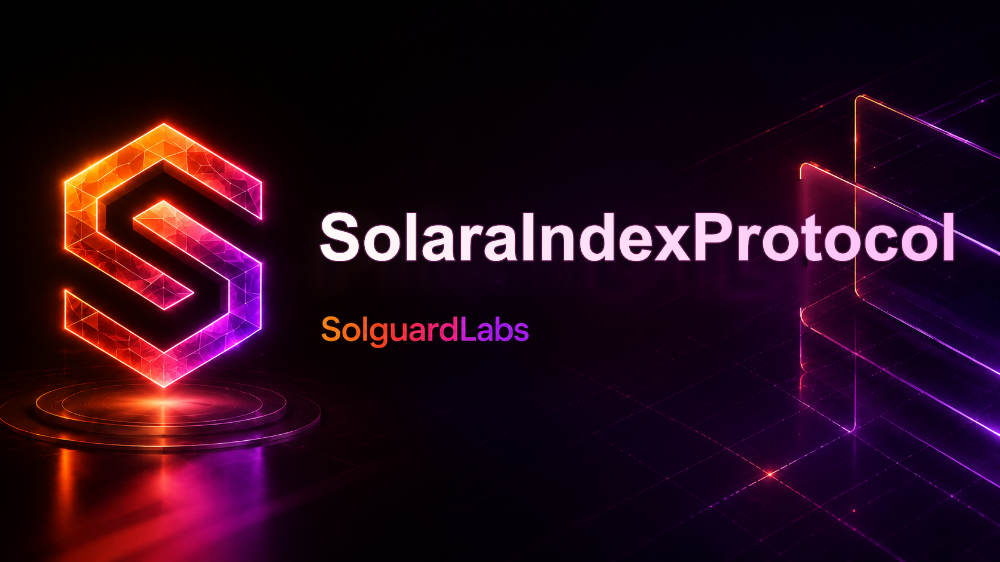

# Solara Index Protocol



Solara Index Protocol es una implementación Solidity/Foundry de un token índice
respaldado por una cesta ponderada de activos ERC-20. El protocolo permite
mintear `SINDEX` mediante depósitos proporcionales de componentes, redimir
participaciones por activos subyacentes y coordinar rebalanceos controlados para
mantener la composición objetivo del índice.

El diseño separa custodia, registro de componentes, cálculo de pesos, oráculos,
vistas de reporting y controles operativos para mantener una superficie modular
y verificable.

## Componentes

- `SolaraIndexProtocol`: bóveda principal de mint, redeem, rebalance y salidas de
  emergencia.
- `SolaraIndexToken`: ERC-20 de 18 decimales emitido por la bóveda.
- `ComponentRegistry`: catálogo de componentes, pesos activos, pesos objetivo y
  límites operativos.
- `SolaraPriceOracle`: precios administrados a 18 decimales con heartbeat y
  rangos permitidos.
- `RebalancePlanner`: módulo de lectura para estimar deltas de rebalance.
- `EmergencyExitModule`: módulo de cotización para salidas de emergencia.
- `SolaraIndexLens` y `SolaraAccountLens`: vistas agregadas de NAV, pesos,
  claims y cuentas.
- `SolaraCircuitBreaker`: guard opcional sobre movimientos de NAV y PPS.

## Flujo del protocolo

1. Los administradores registran componentes elegibles, pesos iniciales,
   tolerancias y límites de inventario.
2. Los operadores de precio publican valores actualizados para cada componente
   dentro de los rangos configurados.
3. Los usuarios depositan la cesta requerida y reciben `SINDEX` según el NAV del
   portfolio.
4. Los usuarios redimen `SINDEX` por una cuota proporcional de los componentes
   mantenidos por la bóveda.
5. Los rebalanceos actualizan pesos objetivo y permiten que la bóveda avance
   hacia la composición definida por la política del índice.
6. Las salidas de emergencia y el circuit breaker reducen el impacto de
   condiciones operativas anómalas.

## Seguridad y controles

- Separación de roles para administración, precios, operaciones y pausa.
- Validación de componentes activos, pesos, límites y disponibilidad de
  inventario.
- Oráculo con heartbeat, límites mínimo/máximo y normalización a 18 decimales.
- Lock de reentrancy en rutas de valor.
- Módulos de lectura separados para reducir complejidad en la bóveda principal.
- Circuit breaker opcional para cambios extremos en NAV o PPS.

Consulta [SECURITY.md](./SECURITY.md) para el modelo de amenazas, alcance de
seguridad y proceso de reporte responsable.

## Requisitos

- Foundry con `forge`.
- Solidity 0.8.24.

## Verificación

```bash
forge fmt --check
forge build
forge test -vvv
```

PowerShell:

```powershell
powershell -ExecutionPolicy Bypass -File ./scripts/tests.ps1
```

Bash:

```bash
bash scripts/tests.sh
```

## Estructura

```text
src/
  access/       roles del protocolo
  core/         registro y lock de reentrancy
  interfaces/   interfaces compartidas
  libraries/    matemáticas, pesos, portfolio y transfers
  lens/         vistas agregadas
  modules/      helpers de rebalance y emergencia
  oracle/       oráculo de precios
  risk/         circuit breaker opcional
  token/        token de índice
  types/        structs y enums del dominio
test/           pruebas Forge de flujos principales
script/         despliegue local básico
scripts/        wrappers reproducibles
```

## Comandos útiles

```bash
forge fmt
forge build
forge test -vvv
forge test --match-test testName -vvvv
```
